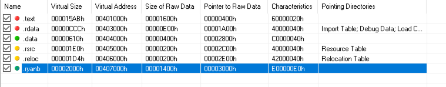
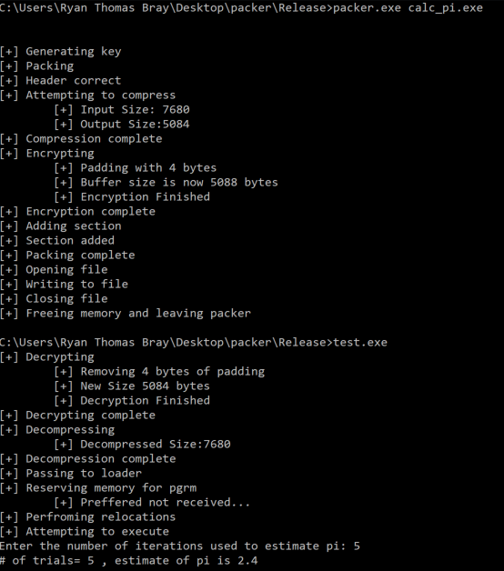
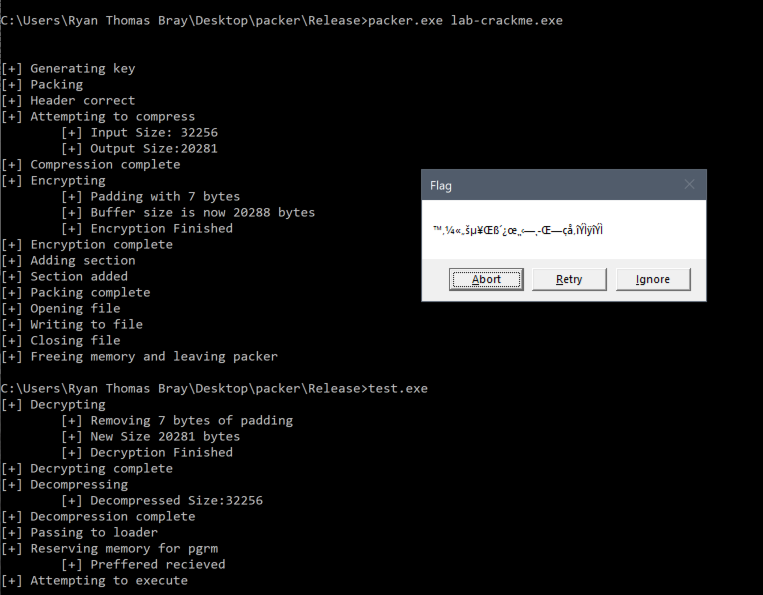

# Project 5 - Packer Creation
## Ryan Thomas Bray

#### Collaboration Statement: Vincent Wells 

## Execution instructions
To execute the program, navigate to the packer/release where the `stub.exe` and `packer.exe` files can be found.  To pack a program, use the command `packer.exe [EXE_FILE_HERE]`(i.e. `packer.exe calc_pi.exe`).  This will result in the creation of `test.exe`.  To execute the packed program, use the command `test.exe`. 

## Methodology

### General Overview
Generally, the packer is broken up into two sections.  The first section is the packer.  The idea of the packer is to take two programs and add one to another and output it to a separate file.  One of the programs the packer requires is the stub (this will be talked about in another section).  The other program that the packer requires is any executable (.exe).  The packer will then add the user specified executable as a section to the end of the stub.exe executable.  The purpose for this is to hide an executable within another.  For example, if a malicious actor wanted to create a piece of trojan ware, it would be useful to hide it within another program so that Intrusion Detection Systems and Operating Systems would be unable to detect its presence.  The Second part of the packer is the stub.  The stub acts as a loader for the user defined executable.  Its goal is to decrypt, decompress and then execute the binary in memory.

### Packer Design
The packer begins by reading in the bytes of the user specified executable into memory.  The packer will then compress and encrypt the user program and then attempt to add the bytes of the file to the end of the `Stub` source code.  This is done by breaking down the program executable (PE) into various subsections.  The PDF below identifies various section necessary for correctly breaking down the stub PE.  

[Peering Inside PE](imgs/pe.pdf "Peering Inside PE")

To successfully add the executable to as a new section at the end of the stub executable there are several steps that need to be completed.  First there should be verification that there is enough space in the PE to add a new section, without this, there is potential to write over memory that will ultimately make the executable crash.  Next, a pointer to the beginning of the new section is needed so that its fields can be edited.  Once the pointer is obtained there are eight fields that need to be either altered or created to add the new section, they are:

- Name of the new section
    - This helps in identifying the section
- Virtual size of new section
    - This will help map the section into memory
- Virtual address of new section
    - This will help map the section into memory
- Size of raw data of new section
    - This will aide patching a pointer to the new section into the stub
- Pointer to raw data of new section
    - This will aide patching a pointer to the new section into the stub
- Characteristics of new section
    - This defines what permissions the program will have
- Resetting the size of the program image
    - This is necessary for the program to appropriately recognize the new section
- Resetting the number of section in the PE
    - This is necessary for the program to appropriately recognize the new section

All of these characteristics can be viewed in `PE-Explorer` for validation purposes.

Considering that the stub and the packer are two independent executables, it will also be important to patch a pointer through to the stub so that it has a pointer in memory to the new section.  This is done by creating a magic value in the stub's `main.exe` file and patching it to point at the new section rather than the magic value.  Since the packer has access to the stub's sections, this magic value will be visible.  Since the magic value is initialized its value will be visible in the `.data` section of the stub.  After scanning and finding the raw address for the magic value it is important to convert the raw address over to the virtual address so that it is possible to search for the pointer to the magic value.  Once the conversion is done, the `.text` section is to be scanned so in search of the virtual address.  Once the virtual address of the magic number is found, the bytes will be over written to the virtual address of the added section.  The machine will then fix up the pointers and the stub will now have access to the added section.  

After this, the packer will write stub and added section out into one file under the name `test.exe` and perform necessary garbage collection

### Stub Design
Since the stub has a pointer to the added section, all it has to do is decrypt, decompress and load the bytes into memory for execution.  After decrypting and decompressing the file is sent to a load function that will perform four tasks.

- First, it will reserve memory for the program.  The program initially will try to reserve its preferred base address.  Due to Address Space Layout Randomization (ASLR), this will not always be possible.  The advantage of reserving a program preferred address is that there will be no need to relocate various memory section within the stub that are memory dependent.
- Next, the loader will load each section in the user specified executable into memory.  This is done by copying the memory from the original pointer to the reserved memory space above.
- If the preferred memory address was not received, then relocations must be performed.  The purpose of the relocations is to map memory dependent instructions to their actual space in memory rather than their preferred spaces in memory
- Lastly the loader will load all library dependencies necessary for program execution.  It does this by identifying DLLs needed and then loaded each individual function required for program execution.

Once these steps are complete the entry point for the executable is casted to a function and then called to execute the program.  The code was tested on various different program.

The stub also contained two anti-debugging techniques incase curious users attempted to debug the executable.  The two techniques used are `MOV SS` and `Close Handle`.  These two techniques would detect the presence and the immediately kill the programs instance.  

